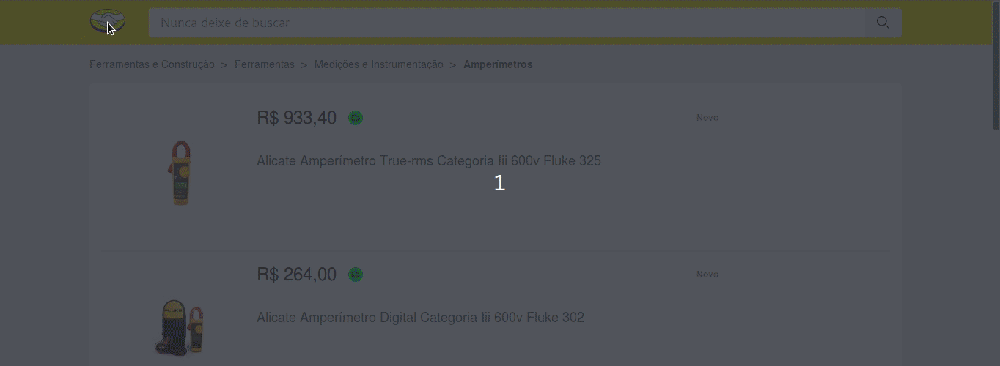

# Mercado Livre - Product Search

## What is this about?

> The project targets to use the [MercadoLibre](https://api.mercadolibre.com/items#options) API to create an interface
> that you can search for a determined product and see the details of each
> result found just by clicking on it.

## How can I get the thing working?

> This project was split into two separated folders, one for the backend application and another one for the frontend. To run each one you just have to do the simple steps below:

### Put the **backend** to work!

Inside the backend folder install the dependencies using [`npm`](https://www.npmjs.com/):

```bash
npm install
```

Or [`yarn`](https://yarnpkg.com/en/package/jest):

```bash
yarn install
```

After all the dependencies have been correctly installed just run the dev script:

```sh
npm run dev
```

or

```sh
yarn dev
```

### Put the **frontend** to work!

Inside the backend folder install the dependencies using [`npm`](https://www.npmjs.com/):

```bash
npm install
```

Or [`yarn`](https://yarnpkg.com/en/package/jest):

```bash
yarn install
```

After all the dependencies have been correctly installed just run the dev script:

```sh
npm run serve
```

or

```sh
yarn serve
```
